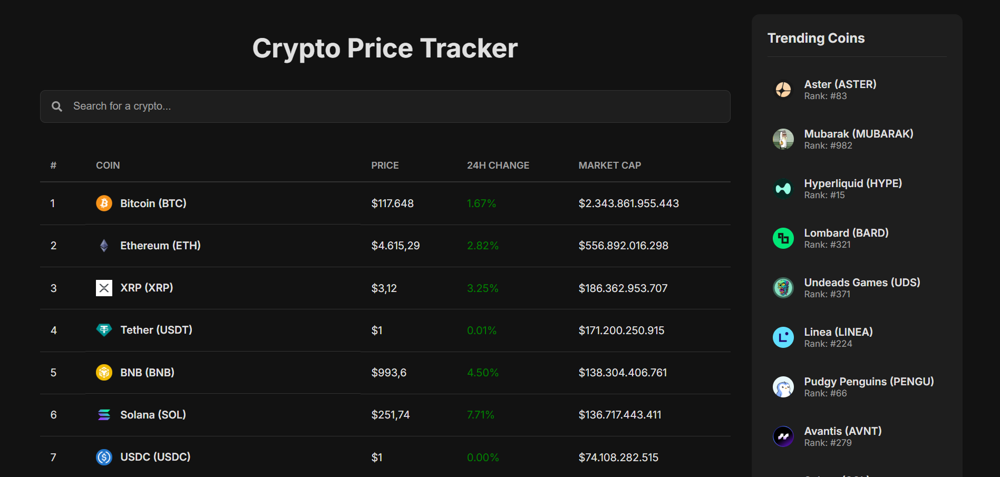

# 🪙 Crypto Price Tracker



A modern and responsive web application built with React and TypeScript that allows users to track cryptocurrency prices, view detailed information, and visualize historical data. This project leverages the CoinGecko API for real-time data.

### ✨ [Live Demo Link](https://crypto-tracker-gray-theta.vercel.app/)

---

## 🚀 Features

- **Real-time Data:** Fetches and displays a list of top cryptocurrencies with live prices, market caps, and 24-hour changes.
- **Pagination:** Easily navigate through the extensive list of available cryptocurrencies.
- **Live Search:** Instantly filter coins by name or symbol.
- **Detailed View:** Click on any coin to navigate to a dedicated page with detailed information, statistics, and a description.
- **Interactive Charts:** Utilizes Recharts to display a 7-day historical price chart for each coin.
- **Trending Coins Sidebar:** A modern, two-column layout featuring a sidebar that shows currently trending cryptocurrencies.
- **Responsive Design:** A fully responsive and modern UI that looks great on all devices, from mobile phones to desktops.
- **Robust API Handling:** Implemented API request cancellation (`AbortController`) to prevent race conditions and handle component unmounting gracefully, even in React's Strict Mode.

---

## 🛠️ Technologies Used

This project is built with a modern frontend stack:

- **Framework:** 
- **Language:** 
- **Build Tool:** 
- **Routing:** 
- **Data Fetching:** 
- **Charting:** 
- **Styling:** Plain CSS with a modern, responsive approach.
- **Icons:** 

---

## 📦 Setup and Installation

To run this project locally, follow these steps:

1.  **Clone the repository:**

    ```bash
    git clone https://github.com/onuryaziici/crypto-tracker.git
    ```

2.  **Navigate to the project directory:**

    ```bash
    cd crypto-tracker
    ```

3.  **Install the dependencies:**

    ```bash
    npm install
    ```

4.  **Start the development server:**
    ```bash
    npm run dev
    ```
    The application will be available at `http://localhost:5173`.

---

## 📊 API Reference

This project uses the free public API provided by **[CoinGecko](https://www.coingecko.com/en/api)**. A huge thanks to them for making this data available.

---

## 🌟 Future Improvements

- [ ] Implement a global state management solution (like Zustand or Context API) for themes or user settings.
- [ ] Add a portfolio feature where users can add coins and track their holdings.
- [ ] Implement a light/dark mode toggle.
- [ ] Add more chart options (e.g., 30 days, 1 year).

---

## 📄 License

This project is licensed under the MIT License. See the `LICENSE` file for details.
